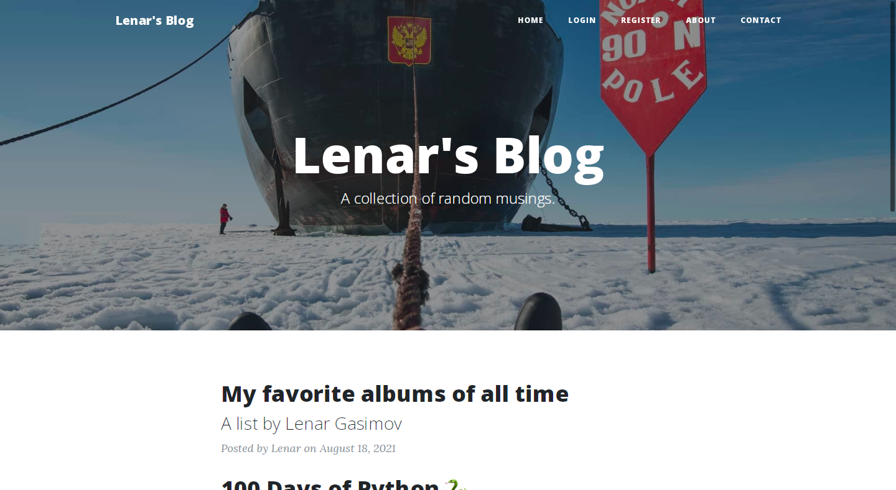

# Blog 

RESTful Blog with Editing.

Blog Project on Python. Anyone can sign up and comment on the blog posts.
Admin can create new blog posts, edit posts and delete posts, all inside the blog website.
On this blog, I document interesting things I learned and share my experience with you.

Check out the blog at [https://lenar-blog.herokuapp.com](https://lenar-blog.herokuapp.com).

## 👨‍💻 Author

 
  

<b>Lenar Gasimov</b> Python developer | Python, Django, Flask.

    

## 💸 Donations

Feel free to use the :octocat: GitHub Sponsor button to donate towards my work if you're feeling generous ☕️

#### 🚧 Under construction... 🚧